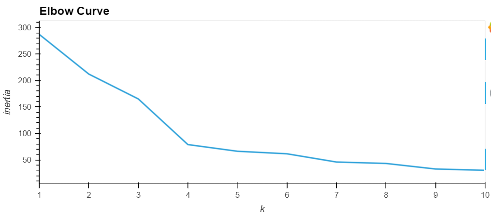
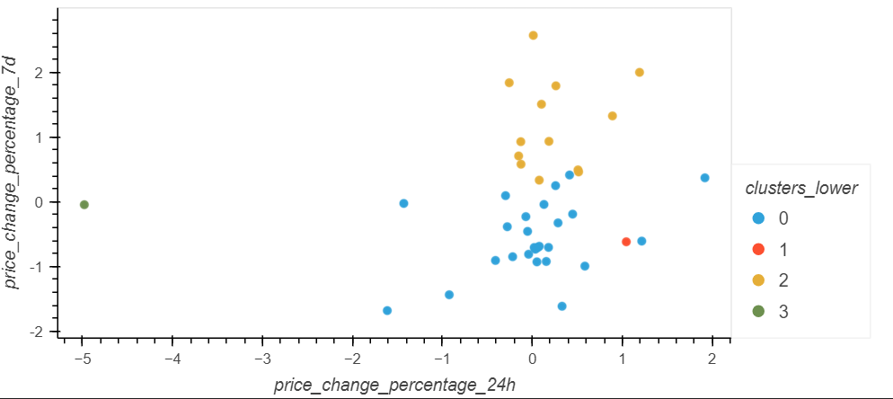
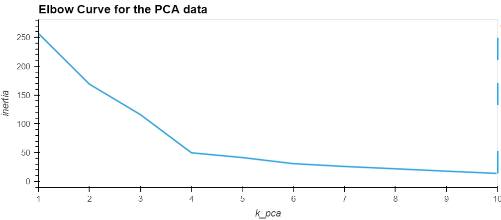
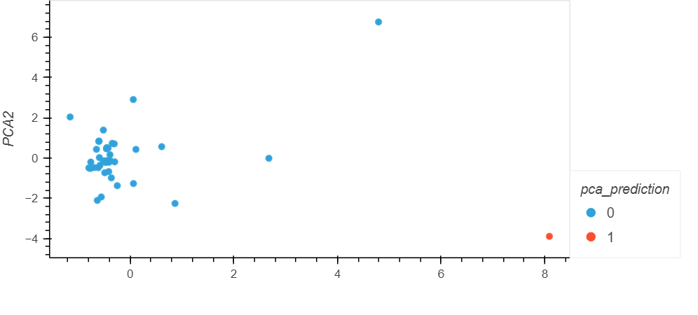
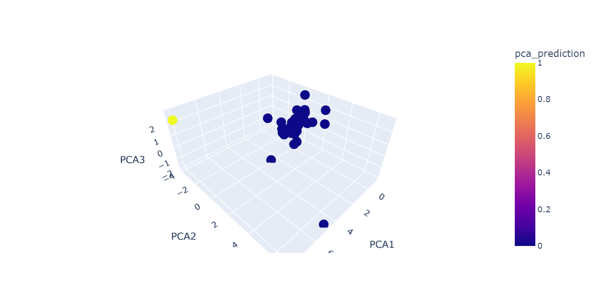

# CryptoClustering
### Overview 

The objective of the Crypto Clustering project is to assess the influence of unsupervised learning methods, notably K-means clustering, in predicting the susceptibility of cryptocurrencies to 24-hour or 7-day price fluctuations. Additionally, the project explores the impact of dimensionality reduction using Principal Component Analysis (PCA) on clustering.

### Steps
1. Load and preprocess the data.
2. Scale the data using StandardScaler.
3. Find the best value for k using the elbow method.
4. Cluster cryptocurrencies with K-means using the original scaled data.
5. Perform PCA to reduce the features to three principal components.
6. Find the best value for k using the PCA data.
7. Cluster cryptocurrencies with K-means using the PCA data.
8. When we are having 3 components it's better to have 3D plot 
9. Visualize and compare the results using hvPlot.

### Visulizations
1. Elbow curve for the original data

2. Scatter plot of cryptocurrency based on the original data

3. Elbow cure for the PCA data

4. Scatter plot of cryptocurrency clusters based on the PCA data.

5. 3D based on the PCA data

### Concusion
Upon reviewing the visual results of the cluster analysis, it became evident that reducing the number of features for K-Means clustering had a profound effect. Initially, the elbow curve suggested an optimal K value of 4, leading to the formation of 4 clusters. However, there were two clusters  each with only one data point, while the remaining two clusters lacked clear separation boundaries. An optimal K value of 2 yielded a more refined and accurate clustering representation.

### Dependencies
* Python
* pandas
* NumPy
* scikit-learn
* hvPlot
* Plotly
